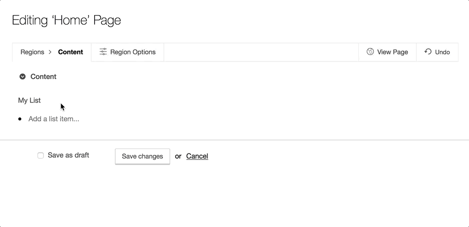

# Perch CMS Superlist Field Type

## What is it?
Adds a field type to Perch CMS that makes it easy to edit and output unordered/ordered lists.

### Features

- Output `ul`s or `ol`s
- Drag and drop to reorder
- Press `Enter` to move to next item
- One click delete
- Add classes to rendered html



## Installation

Copy superlist folder into `/perch/addons/fieldtypes/`

## Usage

Once installed, the field type can be used in a template by specifying the type attribute as superlist:

```
<perch:content id="mylist" type="superlist" label="My List">
```

### Ordered Lists
By default the field type will render a `ul` but you can override this to be an `ol` by adding `ol="true"`

```
<perch:content id="mylist" type="superlist" label="My List" ol="true">
```

### Adding Classes
You can add one or more classes to your list:

```
<perch:content id="mylist" type="superlist" label="My List" class="my-list-class">
```

This will output

```
<ul class="my-list-class">
...
</ul>
```

## Roadmap
- Nested lists
- Switch from jQuery to Vue